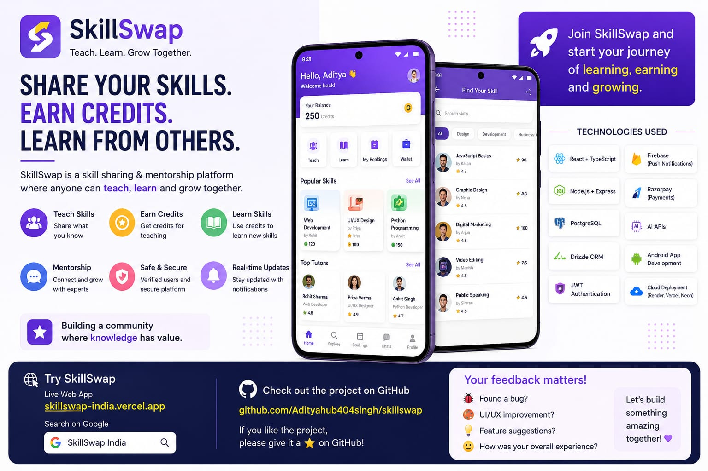
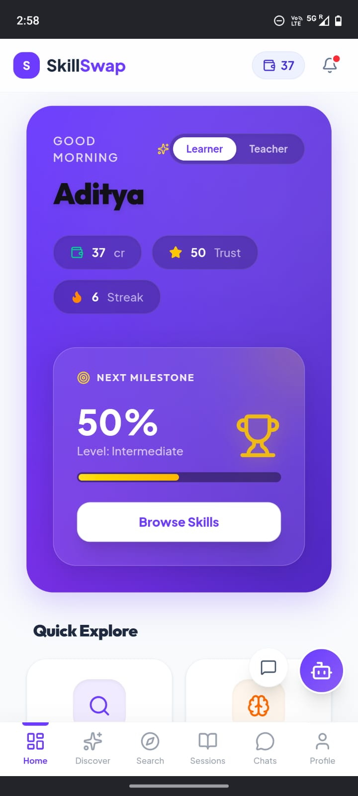
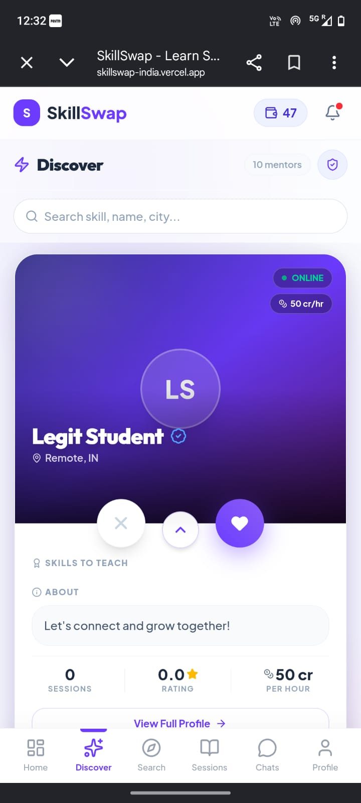
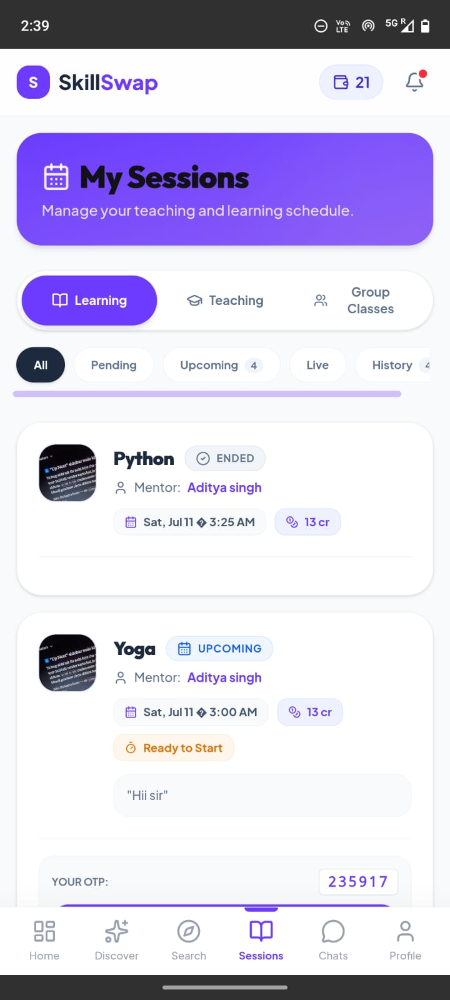
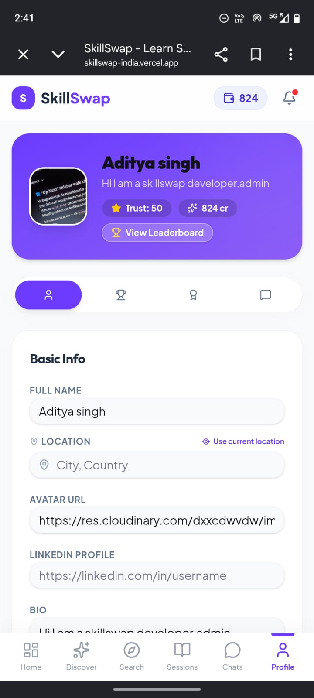
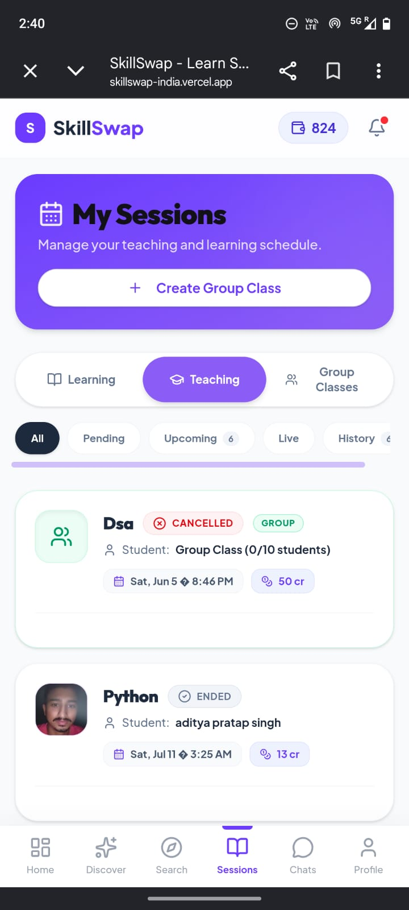
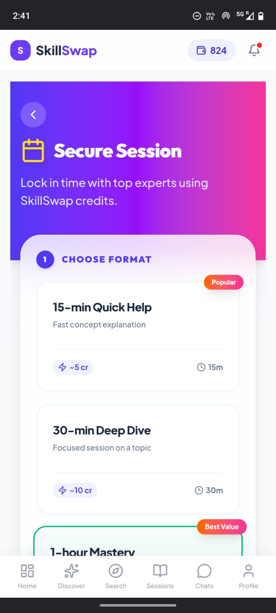

# 🔄 SkillSwap

Learn something new. Teach something you're good at. No money involved — just credits you earn by helping someone else.

That's the whole idea behind SkillSwap. I built it as a peer-to-peer skill exchange platform where anyone can be a mentor and a learner at the same time. Teach a Python session, earn credits, use those credits to finally learn guitar from someone else on the platform.

🌐 **Live app:** [skillswap-fawn-mu.vercel.app](https://skillswap-india.vercel.app/)
⚙️ **Backend API:** [skillswap-b59w.onrender.com](https://skillswap-b59w.onrender.com)

---

## Screenshots

<p align="center">
  
</p>

<table>
  <tr>
    <td></td>
    <td></td>
    <td></td>
  </tr>
  <tr>
    <td align="center"><sub>Dashboard</sub></td>
    <td align="center"><sub>Discover — swipe to match with mentors</sub></td>
    <td align="center"><sub>Sessions & Group Classes</sub></td>
  </tr>
  <tr>
    <td></td>
    <td></td>
    <td></td>
  </tr>
  <tr>
    <td align="center"><sub>Profile</sub></td>
    <td align="center"><sub>Live teaching session</sub></td>
    <td align="center"><sub>More of the app</sub></td>
  </tr>
</table>

---

## What it does

**If you're learning:**
- Swipe through mentors on Discover — filter by skill, city, rating
- Book a 1-on-1 session or hop into a group class with other learners
- Chat with your mentor before/after the session
- Play a daily quiz for a few extra credits, keep your streak alive
- Refer a friend — you both get 50 credits when they finish their first session

**If you're teaching:**
- Accept or negotiate booking requests
- Run group classes for up to 10 students at once — way faster way to earn than one-on-one
- Get rated after every session, build your trust score and badges
- Withdraw your earned credits whenever you hit the payout threshold

**Under the hood:**
- Credits sit in escrow until a session is actually completed — nobody gets stuck or scammed
- Push notifications (Firebase) + email, so you don't miss a booking
- Full native Android/iOS app via Capacitor, not just a website in a wrapper
- An admin panel to actually run the platform — ban/suspend users, resolve disputes, approve withdrawals, broadcast announcements, spot fake accounts

---

## Tech stack

| | |
|---|---|
| Frontend | React, Vite, TypeScript, Tailwind, Framer Motion |
| Backend | Node.js, Express, TypeScript |
| Database | PostgreSQL (Neon) + Drizzle ORM |
| Auth | JWT + Google OAuth |
| File storage | Cloudinary |
| Notifications | Firebase Cloud Messaging, Nodemailer |
| Mobile | Capacitor (Android & iOS) |
| AI | Anthropic Claude API |
| Payments | Razorpay |
| Hosting | Vercel (frontend) · Render (backend) |

---

## Running it locally

You'll need Node.js 18+, a PostgreSQL database (a free [Neon](https://neon.tech) project works fine), and pnpm.

**Frontend:**
```bash
pnpm install
pnpm dev
```

**Backend:**
```bash
cd backend
npm install
npm run dev
```

Backend runs on `localhost:3001`. The frontend dev server talks to it directly.

### Environment variables

`.env` in the project root:
```env
VITE_API_URL=https://skillswap-b59w.onrender.com
```

`backend/.env`:
```env
DATABASE_URL=your_postgresql_url
JWT_SECRET=your_jwt_secret
ANTHROPIC_API_KEY=your_anthropic_key
CLOUDINARY_CLOUD_NAME=your_cloudinary_cloud_name
CLOUDINARY_API_KEY=your_cloudinary_api_key
CLOUDINARY_API_SECRET=your_cloudinary_api_secret
FIREBASE_SERVICE_ACCOUNT=your_firebase_service_account_json
FRONTEND_URL=https://skillswap-fawn-mu.vercel.app
```

Don't commit either `.env` file — both are already in `.gitignore`.

---

## Admin panel

Log in with an admin account and head to `/admin`. From there you can pull up platform stats, manage users (credits, suspend, ban), monitor and resolve session disputes, approve or reject withdrawal requests, send broadcast notifications, and check the fraud-detection report for suspicious accounts.

---

## Project structure

```
skillswap/
├── src/                  # Frontend — React + Vite
│   ├── pages/            # Dashboard, Discover, Sessions, Profile, etc.
│   ├── components/
│   ├── lib/               # API client, push notifications, utils
│   └── store/             # Auth & app state
├── backend/
│   └── src/
│       ├── routes/
│       ├── schema/         # Drizzle ORM schema
│       ├── middlewares/
│       └── notify.ts       # Push + email notification dispatch
├── android/                # Capacitor Android project
└── ios/                    # Capacitor iOS project
```

---

## Contributing

1. Fork the repo
2. `git checkout -b feature/your-feature`
3. `git commit -m "Add your feature"`
4. `git push origin feature/your-feature`
5. Open a Pull Request

---

## License

MIT — use it, fork it, build on it.

---

<p align="center">Built for Hackathon 2026</p>
